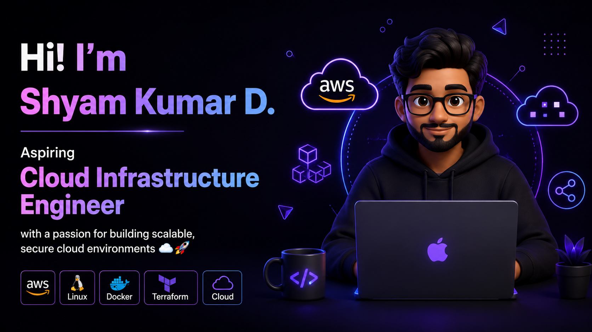

<p align="center">
  
</p>
<p align="center">
  
</p>

<p align="center">
  
  <a href="mailto:dshyamkumar021@gmail.com"></a>
  <a href="https://linkedin.com/in/shyam-kumar-d"></a>
  <a href="https://github.com/ShyamD2"></a>
</p>

---

## 👨‍💻 About Me

```python
class ShyamKumarD:
    name         = "Shyam Kumar D"
    location     = "Madurai, Tamil Nadu, India 🇮🇳"
    degree       = "B.Sc. Networking (Cloud Computing) — SLCS, Madurai (2027)"
    gpa          = 8.4

    stack = [
        "AWS (EC2, S3, ALB, VPC, IAM, Auto Scaling)",
        "Microsoft Azure (Compute, Networking, Storage)",
        "Linux (Ubuntu, Kali)",
        "Python &amp; Bash Scripting",
        "TCP/IP, DNS, DHCP, VPN, OSI Model",
        "Nmap, Burp Suite, Wireshark",
    ]

    currently_learning = [
        "AWS Certified Cloud Practitioner (CLF-C02) — In Progress",
        "Terraform (IaC)",
        "boto3 Cloud Automation",
    ]

    fun_fact = "I built a hybrid cloud VPN across AWS + Azure with zero downtime 🚀"

    def motto(self):
        return "Ship secure, scalable infra. Monitor everything. Leave no downtime."
```

---

## 🛠️ Tech Stack

**Languages**


**Cloud &amp; DevOps**


**Networking &amp; Security**


**OS &amp; Tools**


**Support &amp; CRM**


---

## 🏆 Trophy Wall

<p align="center">
  
</p>

---

## 💼 Work Experience

<details>
<summary><b>🧾 Billing &amp; Inventory Associate — Sapna Garments, Madurai</b> &nbsp;|&nbsp; Sep 2024 – Present (Part-Time)</summary>

<br/>

- Processed **50+ daily billing transactions** (payments, cash reconciliation, POS closing) with **100% accuracy** over 18 months.
- Monitored inventory across **5+ product categories**; coordinated restocking, cutting stockout incidents by **40%**.
- Submitted daily sales and stock reports to management, maintaining **zero discrepancies** across all transaction records.

</details>

<details>
<summary><b>☁️ Cloud Computing with Web Development Intern — Reccsar Pvt. Ltd.</b> &nbsp;|&nbsp; April 2026</summary>

<br/>

- Studied **3 cloud deployment models** — IaaS, PaaS, and SaaS — with practical hosting examples on live platforms.
- Traced the full development-to-deployment lifecycle of a web application architected to handle large-scale cloud traffic.

</details>

---

## 🚀 Featured Projects

<p align="center">

| Project | Stack | Highlights |
|---|---|---|
| **⚡ Scalable Traffic Handling System** | EC2, ALB, Auto Scaling, VPC, IAM | 99% uptime · 3 AZs · 35% fewer response-time incidents · 100% reduction in unauthorised access |
| **🌐 Hybrid Cloud Network Architecture** | AWS + Azure, Site-to-Site VPN, VPC Peering | 99% network availability · 60% fewer config errors · Encrypted cross-cloud data exchange |
| **🔒 Automated Cloud Backup System** *(In Progress)* | Python boto3, EC2, S3, SNS | Automated backup pipeline with event-driven notifications |

</p>

---

## 🎖️ Achievements &amp; Simulations

<p align="center">

| Achievement | Detail |
|---|---|
| 🏅 **Deloitte Data Analytics Simulation** (Forage) | Identified 3 root causes from 6 months of factory data; delivered findings report estimating 20% reliability improvement |
| 🛡️ **Deloitte Cybersecurity Simulation** (Forage) | Assessed 4 enterprise systems; produced incident response docs across 5 threat scenarios |
| ☁️ **AWS CCP CLF-C02** | In Progress — targeting 75%+ on 3 consecutive mock exams before booking |
| 🐧 **Linux 100: Fundamentals** | TCM Security — 2025 |
| 💻 **Programming 100: Fundamentals** | TCM Security — 2025 |
| 🚀 **Zero-Downtime Hybrid VPN** | AWS + Azure VPN with zero downtime during full setup and handover |

</p>

---

## 🎓 Education &amp; Currently Learning

**B.Sc. Networking (Cloud Computing)**
Subbalakshmi Lakshmipathy College of Science, Madurai · GPA: **8.4 / 10.0** · Expected: **May 2027**

**📚 Currently Learning**

```
✅ AWS Certified Cloud Practitioner (CLF-C02) — Final prep stage
🔧 Terraform — Infrastructure as Code
🐍 boto3 — Cloud automation with Python
🔐 IAM Advanced Policies &amp; Security Best Practices
```

---

<p align="center">
  
</p>

<p align="center">
  <i>"Ship secure, scalable infra. Monitor everything. Leave no downtime."</i><br/>
  <b>— Shyam Kumar D · Madurai, Tamil Nadu 🇮🇳</b>
</p>
