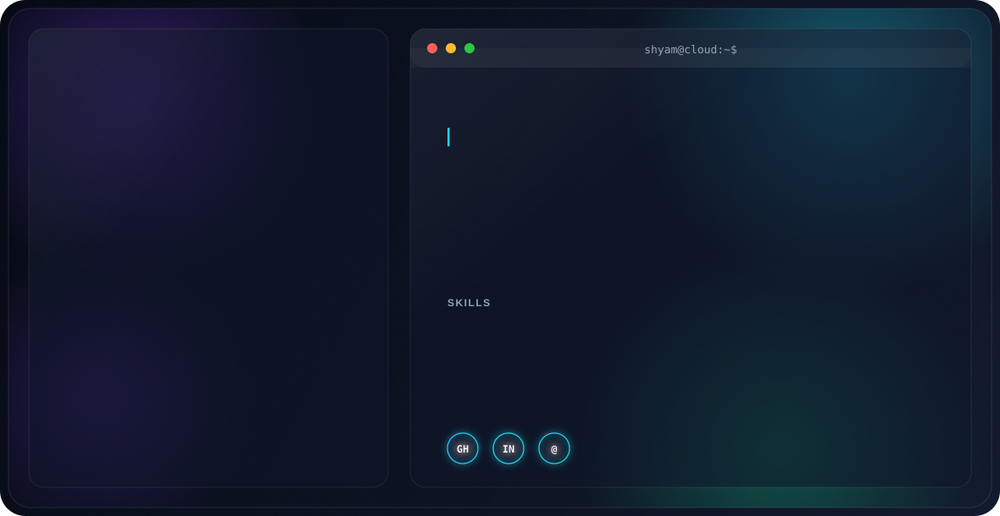

<picture>
  <source media="(prefers-color-scheme: dark)" srcset="./assets/dark.svg">
  <source media="(prefers-color-scheme: light)" srcset="./assets/light.svg">
  
</picture>

<!-- IDENTITY & POSITIONING -->

<h1 align="center">
   SHYAM KUMAR D 
</h1>

<h3 align="center">
Cloud Infrastructure &amp; DevSecOps Engineer | AWS • Kubernetes • Terraform • Linux • FinOps
</h3>

<p align="center">

</p>

<p align="center">
  <b>📍 India</b> &nbsp;|&nbsp; <b>Open to Relocation (Bengaluru • Hyderabad • Chennai) &amp; Remote</b>
</p>

<!-- SOCIAL & CONTACT BADGES -->

<p align="center">

<a href="https://linkedin.com/in/shyam-kumar-d-951254329">

</a>

<a href="mailto:dshyamkumar021@gmail.com">

</a>

<a href="https://github.com/ShyamD2">

</a>


</p>

---

## 👋 Recruiter? Start Here

A fast, zero-friction directory to evaluate my architectural depth, code quality, and cloud deployments across my public repositories:

| What You Are Looking For | Featured Engineering Proof | Primary Technical Stack |
| :--- | :--- | :--- |
| 🌟 **Distributed Systems &amp; FinOps** | [**KubeForecast**](https://github.com/ShyamD2/KubeForecast) — Autonomous EKS Predictive Scheduler | Kubernetes Scheduling Framework, AWS EKS v1.31, Go, 90ns Latency |
| 🛡️ **Cloud Security &amp; SOAR** | [**aegis-cloud-security**](https://github.com/ShyamD2/aegis-cloud-security) — Multi-Account Threat Detection | AWS, EventBridge, Lambda, GuardDuty, Terraform, Automated Containment |
| ⚡ **Serverless FinOps Architecture** | [**aws-cloud-serverless-url-shortener**](https://github.com/ShyamD2/aws-cloud-serverless-url-shortener) — Event-Driven App | Terraform, API Gateway, Lambda, DynamoDB, SQS, CloudWatch |
| 🔐 **Privileged Access Management** | [**SecureVault-Campus**](https://github.com/ShyamD2/SecureVault-Campus) / [**cyberark-pam-lab-api**](https://github.com/ShyamD2/cyberark-pam-lab-api) | Active Directory, PAM Vaulting, Python FastAPI, Docker, pytest |
| ☁️ **AWS Core Infrastructure** | [**Scalable-AWS-Cloud-Infrastructure**](https://github.com/ShyamD2/Scalable-AWS-Cloud-Infrastructure-Deployment) — Multi-AZ VPC | AWS VPC, Application Load Balancer, EC2 Auto Scaling Groups |
| 📄 **Direct Contact &amp; Connect** | [**LinkedIn Profile**](https://linkedin.com/in/shyam-kumar-d-951254329) • [**Email**](mailto:dshyamkumar021@gmail.com) | Response SLA: Under 24 Hours |

---

## 👨‍💻 Executive Engineering Summary

Cloud Infrastructure &amp; DevSecOps Engineer specializing in **AWS cloud architectures**, **Kubernetes fleet orchestration**, **modular Infrastructure as Code (Terraform)**, and **cloud financial engineering (FinOps)**. 

Author of **[KubeForecast](https://github.com/ShyamD2/KubeForecast)**, an autonomous Kubernetes predictive scheduling framework plugin and FinOps cost optimization engine that eliminates structural cloud compute waste by predicting node consolidation targets and steering workloads toward safe waterline nodes before fragmentation occurs (**90.35 ns/op scoring speed, verified 50.0% to 66.7% node fleet reduction on live AWS EKS hardware**).

### 🎯 Current Focus &amp; Goals
* **Core Focus Areas**:
  - **Cloud Infrastructure**: Multi-AZ VPC network design, private subnet isolation, NAT Gateway egress, and least-privilege IAM IRSA federation.
  - **Infrastructure as Code (IaC)**: Modular HashiCorp Terraform architectures, S3 remote state management, and enterprise Helm v3 packaging.
  - **Kubernetes Fleet Engineering**: Custom Go Scheduling Framework plugins (`Score`/`PreScore`), Mutating Admission Webhooks, and Pod Disruption Budget (PDB) safeguards.
  - **Observability &amp; FinOps**: Multi-dimensional Prometheus metric collectors, sub-millisecond PromQL queries, and 5 production Grafana dashboards.
* **Target Certification**:
  - **AWS Certified Solutions Architect – Associate (SAA-C03)** — Target: Q4 2026

---

## 🛠️ Verified Skills &amp; Architectural Evidence

Instead of an unverified list of logos, here is the architectural proof for every skill:

| Engineering Domain | Primary Technologies | Verified Architectural Proof in Code |
| :--- | :--- | :--- |
| **Container Orchestration** | **Kubernetes**, **AWS EKS v1.31**, **Scheduler Framework** | Native Go plugin evaluating `Score`/`PreScore` in **90.35 ns**, Mutating Admission Webhook router, Pod Disruption Budget (PDB) safeguards ([`KubeForecast`](https://github.com/ShyamD2/KubeForecast)). |
| **Infrastructure as Code (IaC)** | **Terraform**, **Helm v3** | 100% codified, modular AWS infrastructure (`modules/vpc`, `modules/eks`, `modules/ecr`, `modules/iam`, `modules/s3`), parameterized Helm packaging with zero ClickOps ([`KubeForecast`](https://github.com/ShyamD2/KubeForecast), [`aws-cloud-serverless-url-shortener`](https://github.com/ShyamD2/aws-cloud-serverless-url-shortener)). |
| **Cloud Infrastructure** | **AWS** (VPC, EC2, ALB, NAT, ECR, IAM IRSA, S3), **Azure** | Dual-AZ isolated public/private network topology, automated rolling ASG scaling, IAM OIDC federation with zero static credentials. |
| **Observability &amp; FinOps** | **Grafana**, **Prometheus**, **CloudWatch** | 5 production Grafana JSON dashboards (`dashboards/grafana/`), sub-millisecond Prometheus exporters, real-time FinOps cost ledger ([`KubeForecast`](https://github.com/ShyamD2/KubeForecast)). |
| **Systems &amp; Languages** | **Go (Golang)**, **Python**, **Bash**, **Linux** (Ubuntu/Kali) | Compiled low-latency Go microservices, boto3 automation scripts, systemd daemons, Linux kernel cgroups v2. |
| **Security &amp; Networking** | **TCP/IP**, **PAM**, **Wireshark**, **Nmap**, **Burp Suite** | Privileged Access Management labs, automated threat containment, security groups, and TLS 1.3 edge termination ([`aegis-cloud-security`](https://github.com/ShyamD2/aegis-cloud-security), [`SecureVault-Campus`](https://github.com/ShyamD2/SecureVault-Campus)). |

---

## 🏗️ How I Build (Engineering Approach)

```
Design → Codify (IaC) → Secure (Least Privilege) → Test (CI/CD) → Monitor (Metrics) → Document
```

* **Infrastructure as Code First**: Zero ClickOps. Every server, VPC route, security group, and container registry is declared in Terraform or Helm.
* **Least-Privilege Security by Design**: Fine-grained IAM Roles for Service Accounts (IRSA), non-root distroless containers, and isolated private subnets.
* **Observable by Default**: Metrics, structured logs, and Grafana dashboards are provisioned alongside the infrastructure.
* **Reproducible &amp; Idempotent**: Single-command automated deployments (`terraform apply`) and deterministic zero-orphan teardowns (`terraform destroy`).

---

## 🚀 Flagship &amp; Featured Projects

<div align="center">

### 🌟 [KubeForecast: Kubernetes Predictive Scheduling &amp; FinOps Optimization Engine](https://github.com/ShyamD2/KubeForecast)
**An autonomous, proactive Kubernetes scheduling framework plugin and FinOps cost optimization engine that eliminates structural cloud compute waste by predicting node consolidation targets and steering workloads toward safe waterline nodes before fragmentation occurs.**

<p align="center">
  <a href="https://github.com/ShyamD2/KubeForecast"></a>
  <a href="https://github.com/ShyamD2/KubeForecast"></a>
  <a href="https://github.com/ShyamD2/KubeForecast"></a>
  <a href="https://github.com/ShyamD2/KubeForecast"></a>
  <a href="https://github.com/ShyamD2/KubeForecast"></a>
  <a href="https://github.com/ShyamD2/KubeForecast"></a>
  <a href="https://github.com/ShyamD2/KubeForecast"></a>
  <a href="https://github.com/ShyamD2/KubeForecast"></a>
</p>

[📂 GitHub Repository](https://github.com/ShyamD2/KubeForecast) • [🎬 Live 1080p Video Player](https://shyamd2.github.io/KubeForecast/video.html) • [📖 18-Page Architecture Presentation (PDF)](https://github.com/ShyamD2/KubeForecast/blob/main/docs/KubeForecast_Executive_Presentation.pdf)

</div>

* **Verified Cost-Benefit Economics**:
  | Cluster Scale | Default Kubernetes Cost | KubeForecast Optimized Cost | Net Savings |
  |---|---|---|---|
  | **Live AWS 3-Node EKS Fleet** | $311.76 / month | $155.88 / month | **50.0% – 66.7% ($155.88/mo)** |
  | **100-Node Enterprise Fleet** | $74,304 / year | $37,152 / year | **$37,152 / year saved** |
* **Sub-Millisecond Execution**: Custom Go Kubernetes Scheduling Framework plugin evaluates candidate nodes in **90.35 nanoseconds** (>11 million evaluations/second).
* **Zero Disruption &amp; PDB-Safe**: 100% compliant with Pod Disruption Budgets, taints, tolerations, and anti-affinity rules, backed by a fail-safe mutating admission router (`failurePolicy: Ignore`).
* **Turnkey IaC &amp; Observability**: Modular Terraform (VPC, EKS v1.31, ECR, IAM IRSA, S3) with Helm v3 deployment, 5 pre-built Grafana dashboards, and an interactive JARVIS HUD cockpit.

---

### Production Cloud, Security &amp; Systems Projects

| Project | Core Stack | Architectural Highlights |
| :--- | :--- | :--- |
| **🛡️ [aegis-cloud-security](https://github.com/ShyamD2/aegis-cloud-security)** | AWS, Terraform, EventBridge, Lambda, GuardDuty, IAM | Multi-account threat detection, automated SOAR containment, attack-path analysis, and immutable forensic evidence preservation. |
| **⚡ [aws-cloud-serverless-url-shortener](https://github.com/ShyamD2/aws-cloud-serverless-url-shortener)** | Terraform, API Gateway, Lambda, DynamoDB, SQS, CloudWatch | Production-style serverless platform with asynchronous analytics, modular IaC, automated security scanning, and FinOps controls. |
| **🔐 [SecureVault-Campus](https://github.com/ShyamD2/SecureVault-Campus)** | Active Directory, Windows Server, Linux, PAM, Docker | Enterprise Privileged Access Management lab simulating credential vaulting, session isolation, and role-based access governance. |
| **🚀 [cyberark-pam-lab-api](https://github.com/ShyamD2/cyberark-pam-lab-api)** | Python FastAPI, Pydantic, Docker, pytest, REST | REST API backing a PAM lab dashboard with typed safe management, account discovery endpoints, and automated unit testing. |
| **🚨 [incident-response-platform](https://github.com/ShyamD2/incident-response-platform)** | Python, Webhooks, Alerting, Operational Runbooks | Incident management platform for automated alert triage, severity classification, and operational runbook execution. |
| **☁️ [Scalable-AWS-Cloud-Infrastructure](https://github.com/ShyamD2/Scalable-AWS-Cloud-Infrastructure-Deployment)** | AWS VPC, EC2, ALB, Auto Scaling, Security Groups | Multi-AZ infrastructure provisioning public/private subnets, Application Load Balancers, and EC2 Auto Scaling groups. |

---

## 💼 Professional Experience

<details open>
<summary><b>☁️ Cloud Computing &amp; Systems Intern — Reccsar Pvt. Ltd.</b> &nbsp;|&nbsp; Apr 2026 – May 2026</summary>

<br/>

- Analyzed and deployed scalable cloud infrastructure patterns across **IaaS, PaaS, and SaaS** models on live cloud environments.
- Implemented network security groups, subnets, and reverse-proxy load balancing architectures to handle high-traffic spikes without single points of failure.
- Traced the full development-to-deployment lifecycle of containerized web services, establishing CI/CD automation and environment reproducibility.

</details>

---

## 🎓 Education

**B.Sc. Networking (Cloud Computing)**  
*Subbalakshmi Lakshmipathy College of Science, Madurai* · Expected: **May 2027**

---

<p align="center">
  
</p>

<p align="center">
  <i>"Build secure, scalable infrastructure. Automate everything. Monitor what matters."</i><br/>
  <b>— Shyam Kumar D · India 🇮🇳</b>
</p>
