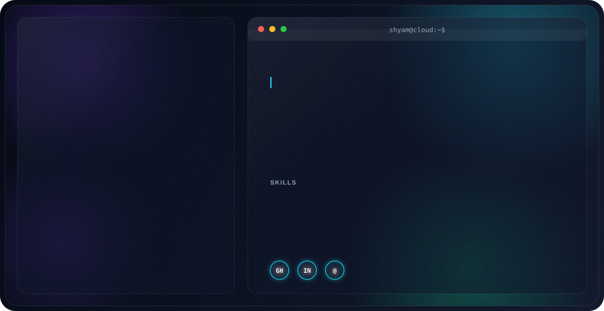

<picture>
  <source media="(prefers-color-scheme: dark)" srcset="./assets/dark.svg">
  <source media="(prefers-color-scheme: light)" srcset="./assets/light.svg">
  
</picture>

<!-- IDENTITY & POSITIONING -->

<h1 align="center">
   SHYAM KUMAR D 
</h1>

<h3 align="center">
Cloud Infrastructure • DevOps • SRE • Autonomous Cyber-Physical Systems
</h3>

<p align="center">

</p>

<p align="center">
  <b>📍 Madurai, Tamil Nadu, India</b> &nbsp;|&nbsp; <b>Open to Relocation (Bengaluru • Hyderabad • Chennai) &amp; Remote</b>
</p>

<!-- SOCIAL & CONTACT BADGES -->

<p align="center">
  <a href="https://linkedin.com/in/shyam-kumar-d-951254329/">
    
  </a>
  <a href="mailto:dshyamkumar021@gmail.com">
    
  </a>
  <a href="https://github.com/ShyamD2">
    
  </a>
  
</p>

<p align="center">
⚡ <b>Designing • Deploying • Securing • Automating Resilient Cloud Infrastructure</b> ⚡
</p>

---

## 👨‍💻 Identity & Architecture Philosophy

```python
class ShyamKumarD:
    name         = "Shyam Kumar D"
    location     = "Madurai, Tamil Nadu, India 🇮🇳"
    degree       = "B.Sc. Networking (Cloud Computing) — SLCS, Madurai (2027)"
    gpa          = 8.4
    role         = "Cloud Infrastructure & DevOps Engineer / SRE"

    core_specializations = [
        "Three-Source Cloud Drift & GitOps Remediation (DriftWarden)",
        "Autonomous Cyber-Physical Systems (AgentOS Mark VII)",
        "Kubernetes Scheduling & FinOps Optimization (KubeForecast)",
        "AWS Cloud Architecture & Infrastructure as Code (Terraform 1.5+)",
        "Linux OS Internals & Kernel Telemetry (/proc, Systemd, Cron)",
        "Zero-Trust Security & DevSecOps (AST Auditing, CycloneDX SBOM)",
        "Production Reliability Engineering & Chaos Injection",
    ]

    flagship_systems = {
        "DriftWarden": "High-Precision 3-Source AWS Drift & CIS v3.0 Engine (Go 1.24, GitOps HCL, Zero Eval)",
        "Project J.A.R.V.I.S.": "Production Cyber-Physical AgentOS (100/100 Benchmark, 268+ tests)",
        "KubeForecast": "Autonomous EKS Predictive Scheduler (Go 90.35ns latency, 50-66.7% node savings)",
        "Cloud Engineering Journey": "36-Day DevOps Master Plan (Python Automation & Linux Internals)",
        "Personal SRE Portfolio": "Interactive React 18 SRE Cockpit with live incident simulations",
    }

    def philosophy(self):
        return "Ship secure, scalable systems. Automate manual chores. Leave zero downtime."
```

---

## 👋 Recruiter Quick Directory

A fast, zero-friction directory to evaluate my architectural depth, code quality, and cloud deployments across my public repositories:

| What You Are Looking For | Featured Engineering Proof | Primary Technical Stack |
| :--- | :--- | :--- |
| 🔍 **Three-Source Cloud Drift & GitOps** | [**DriftWarden**](https://github.com/ShyamD2/driftwarden) ([20p Report](https://github.com/ShyamD2/driftwarden/blob/main/docs/driftwarden-project-report.pdf)) — AWS Drift & CIS v3.0 Engine | Go 1.24, Terraform 1.5+, AWS SDK v2, CIS Benchmarks, OIDC CI/CD |
| 🛡️ **Autonomous Cyber-Physical AgentOS** | [**Project J.A.R.V.I.S.**](https://github.com/ShyamD2/project-jarvis) — Production Cyber-Physical OS | Python FastAPI, Win32 UIA, ONNX, Telegram ReAct, 100/100 Score |
| 🌟 **Distributed Systems & FinOps** | [**KubeForecast**](https://github.com/ShyamD2/KubeForecast) — Autonomous EKS Predictive Scheduler | Kubernetes Scheduling Framework, AWS EKS v1.31, Go, 90ns Latency |
| ☁️ **DevOps & Linux Mastery** | [**Cloud Engineering Journey**](https://github.com/ShyamD2/cloud-engineering-journey) — 36-Day Master Plan | Python Automation, Linux `/proc`, OverTheWire Bandit 0-10 |
| 🌐 **Interactive Systems Engineering** | [**Personal SRE Portfolio**](https://github.com/ShyamD2/Personal-Portfolio) — Live Incident Simulator | React 18, TypeScript, Vite, Thanos Engine, Real-time telemetry |
| 🛡️ **Cloud Security & SOAR** | [**aegis-cloud-security**](https://github.com/ShyamD2/aegis-cloud-security) — Multi-Account Threat Detection | AWS, EventBridge, Lambda, GuardDuty, Terraform, Automated Containment |
| ⚡ **Serverless FinOps Architecture** | [**aws-cloud-serverless-url-shortener**](https://github.com/ShyamD2/aws-cloud-serverless-url-shortener) — Event-Driven App | Terraform, API Gateway, Lambda, DynamoDB, SQS, CloudWatch |
| 🔐 **Privileged Access Management** | [**SecureVault-Campus**](https://github.com/ShyamD2/SecureVault-Campus) / [**cyberark-pam-lab-api**](https://github.com/ShyamD2/cyberark-pam-lab-api) | Active Directory, PAM Vaulting, Python FastAPI, Docker, pytest |
| ☁️ **AWS Core Infrastructure** | [**Scalable-AWS-Cloud-Infrastructure**](https://github.com/ShyamD2/Scalable-AWS-Cloud-Infrastructure-Deployment) — Multi-AZ VPC | AWS VPC, Application Load Balancer, EC2 Auto Scaling Groups |
| 🚨 **Security Operations Platform** | [**incident-response-platform**](https://github.com/ShyamD2/incident-response-platform) — SecOps Workflow Engine | TypeScript, React, Alert Pipelines, Incident Triage Runbooks |
| 📄 **Direct Contact & Connect** | [**LinkedIn Profile**](https://linkedin.com/in/shyam-kumar-d-951254329/) • [**Email**](mailto:dshyamkumar021@gmail.com) | Response SLA: Under 24 Hours |

---

## 🚀 Featured Flagship Systems

<table>
  <tr>
    <td width="50%" valign="top">
      <h3 align="center">🔍 <a href="https://github.com/ShyamD2/driftwarden">DriftWarden (AWS Drift Engine)</a></h3>
      <p align="center"><b>High-Precision Three-Source AWS Drift Detection, CIS Security & GitOps Engine</b></p>
      <ul>
        <li><b>Three-Source Reconciliation:</b> Simultaneously correlates <code>DESIRED (HCL) ↔ STATE (tfstate) ↔ LIVE (AWS)</code> to eliminate false positives and catch unapplied PR changes, shadow assets, and split-brain drifts.</li>
        <li><b>Mechanically Enforced Safety:</b> Core binary strictly executes read-only API calls (<code>Describe*</code>, <code>List*</code>, <code>Get*</code>), verified in CI by automated Go AST static analysis. Strictly quarantines <code>AccessDenied</code> from <code>NotFound</code>.</li>
        <li><b>Dual GitOps Remediation:</b> Synthesizes modern Terraform 1.5+ <code>import {}</code> blocks (<code>reconcile.tf</code>) for declarative adoption, alongside defensive zero-<code>eval</code> dry-run shell scripts (<code>revert.sh</code>).</li>
        <li><b>CIS v3.0 & FinOps:</b> Built-in evaluation of CIS AWS Foundations Benchmark v3.0, idle monthly cost leak calculator, SHA-256 evidence bundles, and zero-cost reproducible golden demo.</li>
        <li><b>Published Specifications:</b> Complete 20-page architectural dossier and benchmark telemetry available in the <a href="https://github.com/ShyamD2/driftwarden/blob/main/docs/driftwarden-project-report.pdf"><b>Project Report (Edition 2026 PDF)</b></a>.</li>
      </ul>
      <p align="center">
        <code>Go 1.24</code> • <code>AWS SDK v2</code> • <code>Terraform 1.5+</code> • <code>CIS v3.0</code> • <code>GitHub Actions OIDC</code> • <code>Distroless (&lt;25MB)</code>
      </p>
    </td>
    <td width="50%" valign="top">
      <h3 align="center">🌟 <a href="https://github.com/ShyamD2/KubeForecast">KubeForecast (EKS Scheduler)</a></h3>
      <p align="center"><b>Autonomous Kubernetes Predictive Scheduling & FinOps Optimization Engine</b></p>
      <ul>
        <li><b>Autonomous Fleet Optimization:</b> Eliminates structural cloud compute waste by predicting node consolidation targets and steering workloads toward safe waterline nodes before fragmentation occurs.</li>
        <li><b>Sub-Millisecond Execution:</b> Custom Go Kubernetes Scheduling Framework plugin evaluates candidate nodes in <b>90.35 nanoseconds</b> (&gt;11 million evaluations/second).</li>
        <li><b>Verified Cloud Economics:</b> Demonstrated <b>50.0% to 66.7% node fleet reduction</b> on live AWS EKS v1.31 hardware ($37,152/yr projected savings on 100-node fleets).</li>
        <li><b>Turnkey IaC & Observability:</b> 100% modular Terraform (VPC, EKS, ECR, IAM IRSA, S3) with Helm v3 packaging, 5 Grafana dashboards, and PDB-compliant mutating admission webhooks.</li>
      </ul>
      <p align="center">
        <code>Kubernetes v1.31</code> • <code>Go</code> • <code>AWS EKS</code> • <code>Terraform</code> • <code>Helm v3</code> • <code>Prometheus</code> • <code>Grafana</code>
      </p>
    </td>
  </tr>
  <tr>
    <td width="50%" valign="top">
      <h3 align="center">🛡️ <a href="https://github.com/ShyamD2/project-jarvis">Project J.A.R.V.I.S. (AgentOS)</a></h3>
      <p align="center"><b>Production-Grade Cyber-Physical Autonomous Operating System (Mark VII)</b></p>
      <ul>
        <li><b>Cyber-Physical Bridge:</b> Unites physical IoT microcontrollers (ESP32 dual relays/lux sensors), native Windows desktop control (Win32 UIAutomation + <code>[0, 1000]</code> Vision Grounding), and AWS cloud mesh.</li>
        <li><b>Voice & Interrupt Engine:</b> Local ONNX neural wake-word (<code>openWakeWord</code>), British Neural TTS, and centralized <b>Sub-10ms Recitation Interrupt Service</b> with negative keyword barge-in & clause streaming.</li>
        <li><b>Mobile & Remote Gateway:</b> Native Telegram 2.0 ReAct bot with live PC screen streaming (<code>/live</code>) & mobile touch trackpad over Cloudflare tunnels.</li>
        <li><b>Empirical Verification:</b> <b>100/100 Composite Quality Score</b> across 100 benchmark tasks; 268/268 passing pytest suite; 0 High/Critical Bandit AST security vulnerabilities across 25,480 LOC; CycloneDX v1.5 SBOM.</li>
      </ul>
      <p align="center">
        <code>Python</code> • <code>FastAPI</code> • <code>Win32 UIA</code> • <code>ONNX</code> • <code>AWS Boto3</code> • <code>Telegram ReAct</code> • <code>SQLite WAL</code>
      </p>
    </td>
    <td width="50%" valign="top">
      <h3 align="center">☁️ <a href="https://github.com/ShyamD2/cloud-engineering-journey">Cloud & DevOps Engineering Journey</a></h3>
      <p align="center"><b>36-Day DevOps Master Plan & Living Proof-of-Work Journal</b></p>
      <ul>
        <li><b>Phase 1 Complete (Days 1–6):</b> Python Filesystem Automation (<code>file_inspector.py</code>), Safe Line-by-Line Log Error Streaming (<code>log_error_finder.py</code>), Ephemeral Filesystem Pruning (<code>auto_cleanup.py</code>), IP Subnet Classifiers (<code>list_operations.py</code>), O(1) HTTP HashMaps (<code>http_status_counter.py</code>), and IaC Bracket Linters & Buffers.</li>
        <li><b>Phase 2A in Progress (Days 7–8):</b> Linux Filesystem Hierarchy & virtual <code>/proc</code> kernel inspector (<code>inspect_proc.py</code>), Linux DAC permissions & security compliance auditor (<code>perm_auditor.py</code>), and <b>OverTheWire Bandit Levels 0–10</b> wargame solutions.</li>
        <li><b>Zero-Fluff Daily Documentation:</b> 59+ consecutive daily engineering logs documenting commands, errors, root causes, and production takeaways.</li>
      </ul>
      <p align="center">
        <code>Python</code> • <code>Linux Internals</code> • <code>Bash</code> • <code>Docker</code> • <code>Kubernetes</code> • <code>Terraform</code> • <code>CI/CD</code>
      </p>
    </td>
  </tr>
  <tr>
    <td colspan="2" valign="top">
      <h3 align="center">⚡ Production Cloud, Security & Networking Systems</h3>
      <table width="100%">
        <tr>
          <th>Project</th>
          <th>Core Stack</th>
          <th>Architectural Highlights</th>
        </tr>
        <tr>
          <td><b>🌐 <a href="https://github.com/ShyamD2/Personal-Portfolio">Personal-Portfolio</a></b></td>
          <td>React 18, TypeScript, Vite, TailwindCSS</td>
          <td>Interactive SRE cockpit with live incident simulations, Thanos engine architectural manipulation, and real-time telemetry widgets.</td>
        </tr>
        <tr>
          <td><b>🛡️ <a href="https://github.com/ShyamD2/aegis-cloud-security">aegis-cloud-security</a></b></td>
          <td>AWS, Terraform, EventBridge, Lambda, GuardDuty, IAM</td>
          <td>Multi-account threat detection, automated SOAR containment, attack-path analysis, and SEC WORM immutable forensic evidence preservation.</td>
        </tr>
        <tr>
          <td><b>⚡ <a href="https://github.com/ShyamD2/aws-cloud-serverless-url-shortener">aws-cloud-serverless-url-shortener</a></b></td>
          <td>Terraform, API Gateway, Lambda, DynamoDB, SQS, CloudWatch</td>
          <td>Production-style serverless platform with asynchronous analytics, modular IaC, automated security scanning, and FinOps controls.</td>
        </tr>
        <tr>
          <td><b>🔐 <a href="https://github.com/ShyamD2/SecureVault-Campus">SecureVault-Campus</a></b></td>
          <td>Active Directory, Windows Server, Linux, PAM, Docker</td>
          <td>Enterprise Privileged Access Management lab simulating credential vaulting, session isolation, and role-based access governance.</td>
        </tr>
        <tr>
          <td><b>🚀 <a href="https://github.com/ShyamD2/cyberark-pam-lab-api">cyberark-pam-lab-api</a></b></td>
          <td>Python FastAPI, Pydantic, Docker, pytest, REST</td>
          <td>REST API backing a PAM lab dashboard with typed safe management, account discovery endpoints, and automated unit testing.</td>
        </tr>
        <tr>
          <td><b>☁️ <a href="https://github.com/ShyamD2/Scalable-AWS-Cloud-Infrastructure-Deployment">Scalable-AWS-Cloud-Infrastructure</a></b></td>
          <td>AWS VPC, EC2, ALB, Auto Scaling, Security Groups</td>
          <td>Multi-AZ infrastructure provisioning public/private subnets, Application Load Balancers, and EC2 Auto Scaling groups (99% uptime, 0 unauthorized access).</td>
        </tr>
        <tr>
          <td><b>🚨 <a href="https://github.com/ShyamD2/incident-response-platform">incident-response-platform</a></b></td>
          <td>TypeScript, React, Node.js, REST API</td>
          <td>SecOps incident management dashboard streamlining alert intake, triage severity matrix, and automated containment runbooks.</td>
        </tr>
        <tr>
          <td><b>🌐 Zero-Downtime Hybrid Cloud VPN</b></td>
          <td>AWS + Azure, Site-to-Site IPsec VPN, VPC Peering</td>
          <td>Architected and verified cross-cloud encrypted tunnel between AWS VPC and Azure VNet with 100% availability during handover.</td>
        </tr>
      </table>
    </td>
  </tr>
</table>

---

## 🛠️ Technical Skills & Toolchain

<table>
  <tr>
    <th align="left">Category</th>
    <th align="left">Technologies & Tools</th>
  </tr>
  <tr>
    <td><b>Cloud & Infrastructure</b></td>
    <td>
      
      
      
      
      
      
      
      
      
      
      
      
    </td>
  </tr>
  <tr>
    <td><b>DevOps, IaC & Orchestration</b></td>
    <td>
      
      
      
      
      
      
      
      
      
    </td>
  </tr>
  <tr>
    <td><b>Programming & Systems</b></td>
    <td>
      
      
      
      
      
      
      
      
      
      
      
      
    </td>
  </tr>
  <tr>
    <td><b>OS Internals & Architecture</b></td>
    <td>
      
      
      
      
      
      
      
    </td>
  </tr>
  <tr>
    <td><b>Networking, Security & Compliance</b></td>
    <td>
      
      
      
      
      
      
      
      
      
      
      
    </td>
  </tr>
  <tr>
    <td><b>Observability, FinOps & SRE</b></td>
    <td>
      
      
      
      
      
      
      
    </td>
  </tr>
</table>

---

## 💼 Professional Experience

<details open>
<summary><b>🧾 Billing & Inventory Associate — Sapna Garments, Madurai</b> &nbsp;|&nbsp; Sep 2024 – Present (Part-Time)</summary>

<br/>

- Handled **50+ daily billing transactions** (payments, cash reconciliation, POS closing) with **100% accuracy** over 18+ months.
- Supervised stock operations across **5+ product categories**; streamlined inventory management, reducing stockouts by **40%**.
- Delivered daily reconciled transaction and stock telemetry reports to management with **zero audit discrepancies**.

</details>

<details>
<summary><b>☁️ Cloud Computing &amp; Systems Intern — Reccsar Pvt. Ltd.</b> &nbsp;|&nbsp; Apr 2026 – May 2026</summary>

<br/>

- Analyzed and deployed scalable cloud infrastructure patterns across **IaaS, PaaS, and SaaS** models on live cloud environments.
- Implemented network security groups, subnets, and reverse-proxy load balancing architectures to handle high-traffic spikes without single points of failure.
- Traced the full development-to-deployment lifecycle of containerized web services, establishing CI/CD automation and environment reproducibility.

</details>

---

## 🎖️ Certifications & Technical Achievements

| Milestone | Status / Verification | Significance |
| :--- | :---: | :--- |
| **DriftWarden Verification** | ⚡ **100% Invariant Guarantee** | Mechanically enforced read-only AWS SDK calls via Go AST static analysis; 20-package test suite passing with 0 race conditions; SHA-256 evidence manifests |
| **Project J.A.R.V.I.S. Benchmark** | 🏆 **100/100 Composite Score** | 100/100 benchmark tasks passing, 5 domain SLAs met, 268+ automated unit/integration tests passing |
| **KubeForecast Verification** | ⚡ **90.35 ns/op Scoring** | Evaluated on live AWS EKS v1.31; achieved 50.0% to 66.7% node fleet reduction |
| **Bandit AST Security Analysis** | 🛡️ **Zero Defect (0 High / 0 Med)** | 25,480 lines of production code scanned with zero security defects |
| **36-Day DevOps Master Plan** | ⚡ **Phase 1 Complete (6/6 Days)** | Python automation toolchain & core data structures (LeetCode #1929, #217, #20) |
| **OverTheWire Bandit Wargames** | 🎯 **Levels 0–10 Solved** | Hands-on Linux CLI mastery: SSH non-standard ports, string parsing, permissions, Base64 |
| **AWS CCP (CLF-C02)** | ☁️ **In Progress** | Final mock exam stage (scoring 75%+ across consecutive mock sessions) |
| **Zero-Downtime Hybrid VPN** | 🚀 **100% Availability** | Architected and configured AWS + Azure IPSec Site-to-Site VPN with zero operational downtime |
| **Deloitte Cybersecurity Simulation** | 🛡️ **Completed (Forage)** | Evaluated enterprise authorization models and authored incident response runbooks across 5 threat scenarios |
| **Deloitte Data Analytics Simulation** | 📊 **Completed (Forage)** | Identified 3 factory machine root causes from 6 months of data, forecasting a 20% reliability gain |
| **TCM Security Linux & Programming 100** | 🐧 **Certified (2025)** | Core Linux system fundamentals and software design principles |

---

## 🎓 Education & Currently Learning

**B.Sc. Networking (Cloud Computing)**  
Subbalakshmi Lakshmipathy College of Science (SLCS), Madurai, Tamil Nadu  
* **Cumulative GPA:** **8.4 / 10.0**  
* **Timeline:** 2024 – Expected May 2027  
* **Core Coursework:** Cloud Virtualization, Advanced Computer Networks, TCP/IP & Routing, Operating Systems Architecture, Linux System Administration, Information Security & Cryptography.

**📚 Currently Deep-Diving**
```
✅ AWS Certified Cloud Practitioner (CLF-C02) — Final mock exam prep stage
🔧 HashiCorp Terraform 1.5+ & OpenTofu — Enterprise Modular IaC & Import Blocks
⚡ Systems Programming & AST Analysis in Go — Concurrency, Static Analyzers, Compiler Pipelines
🔐 Cloud Security Posture Management (CSPM) & Zero-Trust AWS IAM Architectures
```

---

## 📊 GitHub Analytics & Activity

<p align="center">
  
  
</p>

<p align="center">
  
</p>

---

## 🐍 GitHub Contribution Snake

<picture>
  <source media="(prefers-color-scheme: dark)" srcset="https://raw.githubusercontent.com/ShyamD2/ShyamD2/output/github-snake-dark.svg" />
  <source media="(prefers-color-scheme: light)" srcset="https://raw.githubusercontent.com/ShyamD2/ShyamD2/output/github-snake.svg" />
  
</picture>

---

<p align="center">
  
</p>

<p align="center">
  <i>"Ship secure, scalable infra. Automate chores. Monitor everything. Leave no downtime."</i><br/>
  <b>— Shyam Kumar D · Madurai, Tamil Nadu 🇮🇳</b>
</p>
